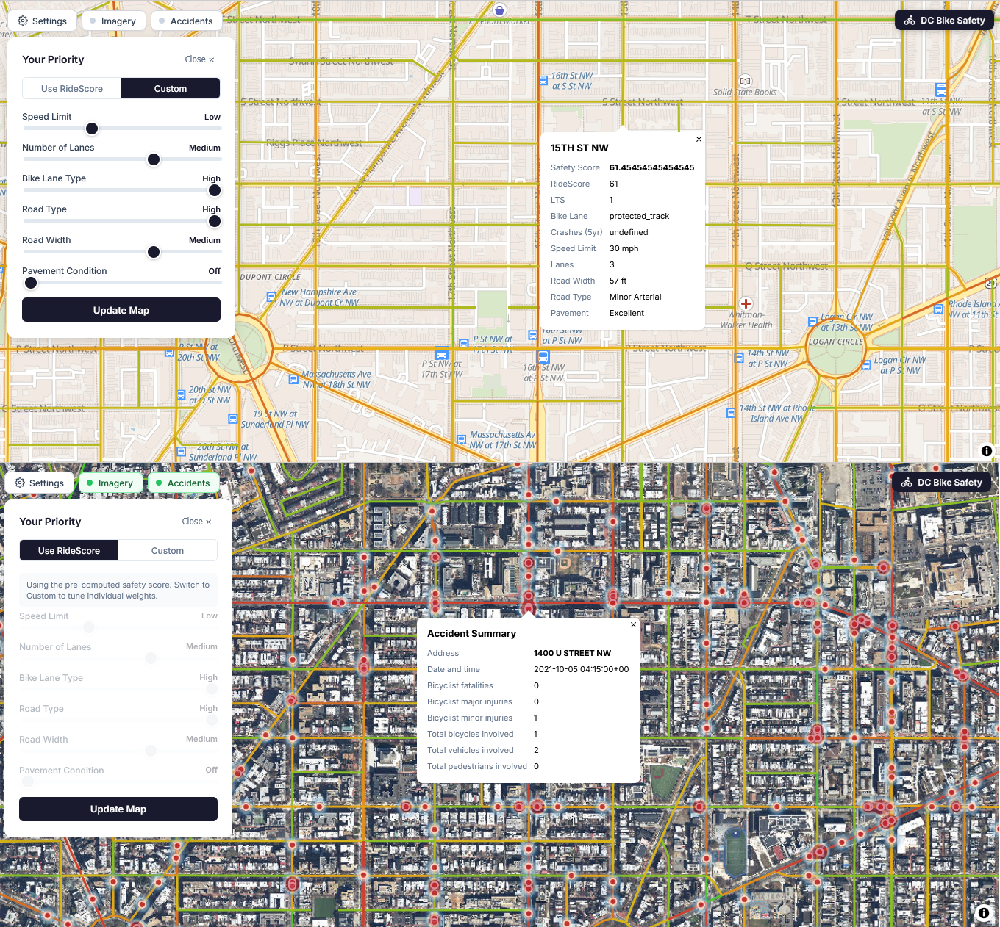

# Interactive DC Bike Safety Map

This project creates a preliminary interactive bike safety map for the streets of Washington DC. You can explore it [here](http://161.35.142.176/). It does the following:
* pulls [road](https://opendata.dc.gov/datasets/DCGIS::roadway-block/about) and [crash](https://opendata.dc.gov/datasets/crashes-in-dc/about) data from the Open Data DC portal.
* process them and create bike safety factors and a default ridescore
* setups of the database and map tiling backend
* Displays a map with: the default safety score, the ability for the user to re-weigh factors to create their own safety score, overhead imagery toggle, 5 years of bike accident history toggle, and the ability to click on a road segment to see it's attributes.



## Data Processing

The map uses [road](https://opendata.dc.gov/datasets/DCGIS::roadway-block/about) and [crash](https://opendata.dc.gov/datasets/crashes-in-dc/about) data from the Open Data DC portal. The road data are simplified and cleaned up (see jupyter notebook for details). For the crash data, we only use crashes that resulted in a bicyclist fatality or injury from the last 5 years.

## Safety score and interactive factors

The LTS and ridescore build on 01_lts_osm_elia_v2.ipynb.

We use our own, modified level of traffic stress (LTS) calculator.

<table>
  <tbody>
    <tr>
      <th>Bike lane</th>
      <th>Number of lanes</th>
      <th>Speed limit</th>
      <th>Road function</th>
      <th>LTS</th>
    </tr>
    <tr style="background-color: #a4f1b6;">
      <td>Protected track</td>
      <td>-</td>
      <td>-</td>
      <td>-</td>
      <td>1</td>
    <tr style="background-color: #f7f08c;">
      <td>Buffered lane or painted lane</td>
      <td>&lt;= 2</td>
      <td>&lt;= 25</td>
      <td>-</td>
      <td>2</td>
    </tr>
    <tr style="background-color: #f7f08c;">
      <td>None</td>
      <td>&lt;= 2</td>
      <td>&lt;= 25</td>
      <td>Local</td>
      <td>2</td>
    </tr>
    <tr style="background-color: #f0c77b;">
      <td>Buffered lane or painted lane</td>
      <td>&gt;2 and &lt;=3</td>
      <td>&gt;25 and &lt;= 30</td>
      <td>-</td>
      <td>3</td>
    </tr>
    <tr style="background-color: #f0c77b;">
      <td>None</td>
      <td>&lt;=2</td>
      <td>&gt;25 and &lt;= 30</td>
      <td>Local</td>
      <td>3</td>
    </tr>
    <tr style="background-color: #e47d86;">
      <td colspan="4">Any other combination</td>
      <td>4</td>
    </tr>
  </tbody>
</table>

We then use it to create our own road safety score (the default on the website). It has 3 components:

1) LTS levels are translated into the score using the following dictionary: {1:100, 2:75, 3:40, 4:10, none = 10}
2) Type of bike lane is translated into a score using the following: {"protected_track":10, "buffered_lane":5, "painted_lane":3, "none":0}
3) In short, the number of crashes is normalized to 100 \* (1- num_crash/95th_percentile of crashes).

They are then combined with the weighted sum: LTS\*0.6 + Crash\*0.3 + bike_lane\*0.1.

The users can also create their own weighing the following factors:
* Speed limit
* Number of lanes
* Bike lane type
* Road type
* Road width
* Pavement condition

See data_processing jupyter notebook for more details on translation from raw factors to 0-100 score. They are then combined with the following postgres function:

``` SQL
CREATE OR REPLACE FUNCTION update_score(z integer, x integer, y integer, query_params json)
RETURNS bytea AS $$
DECLARE
  mvt bytea;
  bounds geometry;
BEGIN
  -- Tile bounds in 3857
  bounds := ST_TileEnvelope(z, x, y);

  SELECT INTO mvt
  ST_AsMVT(tile, 'update_score', 4096, 'geom')
  FROM (
    SELECT
      ST_AsMVTGeom(
        ST_Transform(wkb_geometry, 3857),
        bounds,
        4096,
        64,
        true
      ) AS geom,
      (ridescore_v1*(query_params->>'i_ridescore')::int + speedlimit_score*(query_params->>'i_speedlimit')::int +
num_lanes_score*(query_params->>'i_numlanes')::int+ facility_score*(query_params->>'i_facility')::int+ function_score*(query_params->>'i_function')::int+ road_width_score*(query_params->>'i_roadwidth')::int+ pavement_condition_score*(query_params->>'i_pavement')::int) / ((query_params->>'i_ridescore')::int + (query_params->>'i_speedlimit')::int+ (query_params->>'i_numlanes')::int+ (query_params->>'i_facility')::int+ (query_params->>'i_function')::int+ (query_params->>'i_roadwidth')::int+ (query_params->>'i_pavement')::int) AS user_score,
	route_name,
	bike_facility_type,
	function,
	lts_level,
	num_lanes_raw,
	parking_presence,
	pavement_condition,
	ridescore_v1,
	road_width,
	speed_limit_raw	
    FROM ridescoredc
    WHERE wkb_geometry &&
          ST_Transform(bounds, 4326)
  ) AS tile
  WHERE geom IS NOT NULL;

  RETURN mvt;
END
$$ LANGUAGE plpgsql STABLE STRICT PARALLEL SAFE;

```
## Backend and Frontend setup instructions (with DigitalOcean Droplet)

Coming soon